# Regular Expression Demo and Practice Files

- **Produced by:** [Graham Watts](https://github.com/GingerGraham)
- **Date:** November 2023

The purpose of the files in this directory is to provide a set of files that can be used to practice regular expressions. The files are intended to be used in conjunction with my [Regular Expressions](https://www.grahamwatts.co.uk/regex) blog post. In the sections belows we'll explore some example regular expressions targetting both a regular text file and a common format log file. Examples of the output will be provided to help you check your work. At the end of each section there will be some suggested stretch goals for further practice.

The work here is my own and supported by [GitHub Copilot](https://github.com/features/copilot) except where otherwise explicitly stated. I make this work freely available to support the knowledge and development of others.

## Table of Contents

- [Regular Expression Demo and Practice Files](#regular-expression-demo-and-practice-files)
  - [Table of Contents](#table-of-contents)
  - [Getting started](#getting-started)
    - [Seeing the log format before we start](#seeing-the-log-format-before-we-start)
    - [Tools](#tools)
      - [grep](#grep)
      - [Select-String](#select-string)
    - [Other Tools](#other-tools)
  - [Text File: SampleText.txt](#text-file-sampletexttxt)
    - [Simple Example](#simple-example)
    - [Capitalised First Letter Example](#capitalised-first-letter-example)
    - [Or Search Example](#or-search-example)
    - [Optional Characters Example](#optional-characters-example)
    - [Stretch Goals For Text File](#stretch-goals-for-text-file)
  - [Linux Log File: Linux\_2k.log](#linux-log-file-linux_2klog)
    - [Stretch Goals For Linux Log File](#stretch-goals-for-linux-log-file)
  - [Web Server Log File: ApacheWeb.log](#web-server-log-file-apacheweblog)
    - [Finding Errors in Web Logs](#finding-errors-in-web-logs)
    - [Match Groups](#match-groups)
    - [Stretch Goals For Web Server Log File](#stretch-goals-for-web-server-log-file)
  - [Stretch Goal Answers](#stretch-goal-answers)
    - [Text File](#text-file)
    - [Linux Log File](#linux-log-file)
    - [Web Server Log File](#web-server-log-file)

## Getting started

For the best experience I recommend viewing this file in a text editor that supports Markdown and Markdown preview such as [VS Code](https://code.visualstudio.com/), or in a specialised Markdown editor such as [Typora](https://typora.io/).

A good strategy when starting out is to build up your regular expressions slowly. Start with something simple to find whole line we think we want, and run it to check. When iterate on that to make it more specific, and run it again to check. Keep iterating until you have the result you want. This will help you to build up your regular expressions in a more manageable way and help you to understand what each part of the regular expression is doing. If the output isn't what you expected it's much easier to work out where you went wrong if you've only changed one thing at a time.

### Seeing the log format before we start

It's always a good idea to check out the log we're working with and ideally examples of the entries that we're working with before we start. This will help us to understand the format of the log and what we're looking for. It can also give us some hints around possible data that we don't want to see and therefore help us to start tailoring our regular expressions to be more specific.

With the files provided they can be opened in any text editor or on the command line with tools like `cat`, `less` or `Get-Content`. For example:

```bash
cat SampleText.txt
```

Or, in PowerShell:

```powershell
Get-Content SampleText.txt
```

### Tools

These examples are intended to be completed with common, command line regular expression tools such as `grep` for bash (and similar shells) on Linux and MacOS and/or `Select-String` for PowerShell on Windows. If you are using Windows 10 or 11 and want to experiment with the Linux examples, you can use the [Windows Subsystem for Linux](https://docs.microsoft.com/en-us/windows/wsl/install/) to run the Linux examples. Alternatively, if you're on Linux or MacOS and want to try out the PowerShell you can install [PowerShell](https://learn.microsoft.com/en-us/powershell/scripting/install/installing-powershell) on your system.

#### grep

`grep` is a command line tool found on most Linux and MacOS systems and can be run from the terminal in shells such as bash and zsh.

To use regular expressions with `grep` you need to use the `-E` flag to enable extended regular expressions. For example:

```bash
grep -E 'regex' file.txt
```

In some cases the `-E` flag may not work, particularly with regex characters such as `\d` so you may wish to experiment with the `-P` flag to enable Perl regular expressions. For example:

```bash
grep -P 'regex' file.txt
```

#### Select-String

`Select-String` is a PowerShell cmdlet that can be used to search for text in files and/or strings. It can be used in the PowerShell terminal or in PowerShell scripts.

To use regular expressions with `Select-String` you need to use the `-Pattern` parameter. For example:

```powershell
Select-String -Pattern 'regex' -Path file.txt
```

You may notice when using `Select-String` that the return includes the file name and line number of the match. Depending on your perspective this may, or may not be useful, but in my experience at least I prefer to not see it. The reason it happens is related to PowerShell seeing all output as objects and not just text. As such, it will return the object that contains the match, which includes the file name and line number. In some cases you might just be able to use the `-SimpleMatch` switch, however if your search is more complicated you may need to use the `-AllMatches` switch and then use the `Select-Object` or `ForEach-Object` cmdlets to extract the matches you want. For example:

```powershell
Select-String -Pattern 'regex' -Path file.txt -AllMatches | ForEach-Object { $_.Matches.Value }
```

or this:

```powershell
Select-String -Pattern 'regex' -Path file.txt -AllMatches | Select-Object -ExpandProperty Matches | Select-Object -ExpandProperty Value
```

You will see me use both of these approaches in the examples below.

### Other Tools

The nature of working on the command line is that often commands will be piped into other commands to achieve the desired result. As such, you will come across other commands in this guide which are not specific to regular expressions but that may be needed to achieve the desired result. PowerShell in particular often needs a number of cmdlets to be piped together where it treats all output as objects and not just text. This can often complicate the look of the commands needed. Don't be put off if things look complicated, I will try to explain them as we go along. You can also take the commands and break them down into smaller chunks to see what each part does by gradually building up each command breaking at the pipe (`|`) character. Lastly, there are always online tools such as [Regex101](https://regex101.com/) and [Regexr](https://regexr.com/) that can be used to test regular expressions and see what they match, or tools such as [ChatGPT](https://openai.com/chatgpt) or [Bing Chat](https://www.bing.com/chat) that you can use to explore and explain the provided commands.

[Back to the top](#top)

## Text File: SampleText.txt

### Simple Example

We'll start with a simple search using `grep` for the word `Word` in the file `SampleText.txt`:

```bash
grep -E 'Word' SampleText.txt
```

The output should look like this:

```text
> grep -E "Word" SampleText.txt

Video provides a powerful way to help you prove your point. When you click Online Video, you can paste in the embed code for the video you want to add. You can also type a keyword to search online for the video that best fits your document. To make your document look professionally produced, Word provides header, footer, cover page and text box designs that complement each other. For example, you can add a matching cover page, header and sidebar. Click Insert, then choose the elements you want from the different galleries. Regular expressions, often abbreviated as regex, are a powerful tool used in computing for pattern matching and manipulation of text.
Themes and styles also help to keep your document coordinated. When you click Design and choose a new Theme, the pictures, charts and SmartArt graphics change to match your new theme. When you apply styles, your headings change to match the new theme. Save time in Word with new buttons that show up where you need them. To change the way a picture fits in your document, click it and a button for layout options appears next to it. When you work on a table, click where you want to add a row or a column, then click the plus sign. Regular expressions are sequences of characters that form a search pattern, mainly for use in pattern matching with strings, or string matching, i.e., “find and replace”-like operations.
```

Note that most terminals will highlight or colour the matched text. In the example above the word `Word` would highlighted in red, as below.

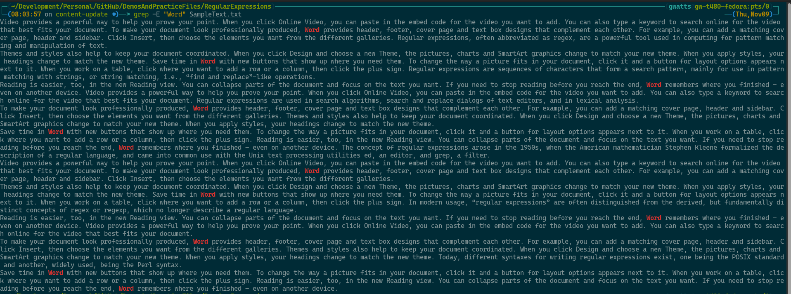

We can make the same search using `Select-String` in PowerShell:

```powershell
Select-String -Pattern 'Word' -Path SampleText.txt
```

The output should look like this:

```text
> Select-String -Pattern 'Word' -Path SampleText.txt

SampleText.txt:1:Video provides a powerful way to help you prove your point. When you click Online Video, you can paste in the embed code for the video you want to add. You can also type a keyword to search 
online for the video that best fits your document. To make your document look professionally produced, Word provides header, footer, cover page and text box designs that complement each other. For example, you 
can add a matching cover page, header and sidebar. Click Insert, then choose the elements you want from the different galleries. Regular expressions, often abbreviated as regex, are a powerful tool used in 
computing for pattern matching and manipulation of text.
SampleText.txt:3:Themes and styles also help to keep your document coordinated. When you click Design and choose a new Theme, the pictures, charts and SmartArt graphics change to match your new theme. When you 
apply styles, your headings change to match the new theme. Save time in Word with new buttons that show up where you need them. To change the way a picture fits in your document, click it and a button for 
layout options appears next to it. When you work on a table, click where you want to add a row or a column, then click the plus sign. Regular expressions are sequences of characters that form a search pattern, 
mainly for use in pattern matching with strings, or string matching, i.e., “find and replace”-like operations.
```

Again, the output will be marked by the terminal such as the image below:

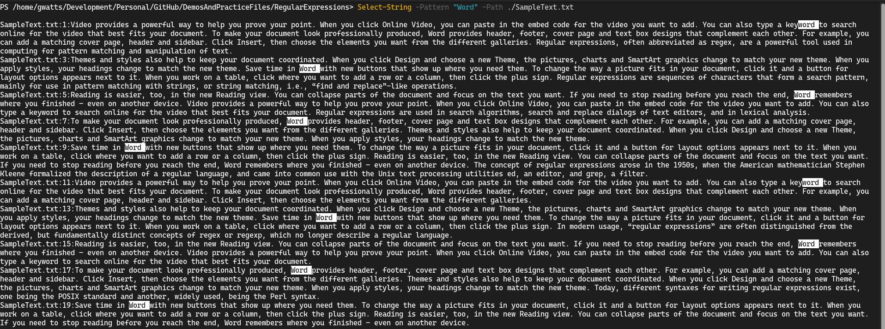

This doesn't really show the use and power of regular expressions, so let's try something a little more interesting.

### Capitalised First Letter Example

If you've looked at SampleText.txt you may have spotted that the phrase "regular expression" has appeared a number of times, sometimes as "Regular Expression" and sometimes as "regular expression". Let's see if we can find all the instances in the file, regardless of capitalisation. Now, there are several ways to go about this with grep, such as using the `-i` flag, however we're going to focus specifically on using regular expressions.

We could try something like this:

```bash
grep -E 'regular expression' SampleText.txt
```

Or, in PowerShell:

```powershell
Select-String -Pattern 'regular expression' -Path SampleText.txt
```

However, this will only find the lines with the exact phrase "regular expression" in lower case like this:

```text
> grep -E "regular expression" SampleText.txt

Save time in Word with new buttons that show up where you need them. To change the way a picture fits in your document, click it and a button for layout options appears next to it. When you work on a table, click where you want to add a row or a column, then click the plus sign. Reading is easier, too, in the new Reading view. You can collapse parts of the document and focus on the text you want. If you need to stop reading before you reach the end, Word remembers where you finished – even on another device. The concept of regular expressions arose in the 1950s, when the American mathematician Stephen Kleene formalized the description of a regular language, and came into common use with the Unix text processing utilities ed, an editor, and grep, a filter.
Themes and styles also help to keep your document coordinated. When you click Design and choose a new Theme, the pictures, charts and SmartArt graphics change to match your new theme. When you apply styles, your headings change to match the new theme. Save time in Word with new buttons that show up where you need them. To change the way a picture fits in your document, click it and a button for layout options appears next to it. When you work on a table, click where you want to add a row or a column, then click the plus sign. In modern usage, “regular expressions” are often distinguished from the derived, but fundamentally distinct concepts of regex or regexp, which no longer describe a regular language.
To make your document look professionally produced, Word provides header, footer, cover page and text box designs that complement each other. For example, you can add a matching cover page, header and sidebar. Click Insert, then choose the elements you want from the different galleries. Themes and styles also help to keep your document coordinated. When you click Design and choose a new Theme, the pictures, charts and SmartArt graphics change to match your new theme. When you apply styles, your headings change to match the new theme. Today, different syntaxes for writing regular expressions exist, one being the POSIX standard and another, widely used, being the Perl syntax.
```

Note that we have fewer lines returned by this search than we did with the simple search for the word "Word". This is because we are only matching the exact phrase "regular expression" in lower case. The same thing would happen if we searched for "Regular Expression" in upper case. Give that a try yourself with this command and see:

```bash
grep -E 'Regular Expression' SampleText.txt
```

Or, in PowerShell:

```powershell
Select-String -Pattern 'Regular Expression' -Path SampleText.txt
```

So, what we need is a way to tell the search engine that we want the "r" in "regular" to either be "R" or "r". We also need to achieve the same thing with "e" in "expression". Fortunately, regular expressions allow us to express allow character sets using the `[ ]` syntax. So, we can try something like this:

```bash
grep -E '[Rr]egular [Ee]xpression' SampleText.txt
```

Or, in PowerShell:

```powershell
Select-String -Pattern '[Rr]egular [Ee]xpression' -Path SampleText.txt
```

The output should look like this:

```text
> grep -E "[Rr]egular [Ee]xpression" SampleText.txt

Video provides a powerful way to help you prove your point. When you click Online Video, you can paste in the embed code for the video you want to add. You can also type a keyword to search online for the video that best fits your document. To make your document look professionally produced, Word provides header, footer, cover page and text box designs that complement each other. For example, you can add a matching cover page, header and sidebar. Click Insert, then choose the elements you want from the different galleries. Regular expressions, often abbreviated as regex, are a powerful tool used in computing for pattern matching and manipulation of text.
Themes and styles also help to keep your document coordinated. When you click Design and choose a new Theme, the pictures, charts and SmartArt graphics change to match your new theme. When you apply styles, your headings change to match the new theme. Save time in Word with new buttons that show up where you need them. To change the way a picture fits in your document, click it and a button for layout options appears next to it. When you work on a table, click where you want to add a row or a column, then click the plus sign. Regular expressions are sequences of characters that form a search pattern, mainly for use in pattern matching with strings, or string matching, i.e., “find and replace”-like operations.
Reading is easier, too, in the new Reading view. You can collapse parts of the document and focus on the text you want. If you need to stop reading before you reach the end, Word remembers where you finished – even on another device. Video provides a powerful way to help you prove your point. When you click Online Video, you can paste in the embed code for the video you want to add. You can also type a keyword to search online for the video that best fits your document. Regular expressions are used in search algorithms, search and replace dialogs of text editors, and in lexical analysis.
Save time in Word with new buttons that show up where you need them. To change the way a picture fits in your document, click it and a button for layout options appears next to it. When you work on a table, click where you want to add a row or a column, then click the plus sign. Reading is easier, too, in the new Reading view. You can collapse parts of the document and focus on the text you want. If you need to stop reading before you reach the end, Word remembers where you finished – even on another device. The concept of regular expressions arose in the 1950s, when the American mathematician Stephen Kleene formalized the description of a regular language, and came into common use with the Unix text processing utilities ed, an editor, and grep, a filter.
Themes and styles also help to keep your document coordinated. When you click Design and choose a new Theme, the pictures, charts and SmartArt graphics change to match your new theme. When you apply styles, your headings change to match the new theme. Save time in Word with new buttons that show up where you need them. To change the way a picture fits in your document, click it and a button for layout options appears next to it. When you work on a table, click where you want to add a row or a column, then click the plus sign. In modern usage, “regular expressions” are often distinguished from the derived, but fundamentally distinct concepts of regex or regexp, which no longer describe a regular language.
To make your document look professionally produced, Word provides header, footer, cover page and text box designs that complement each other. For example, you can add a matching cover page, header and sidebar. Click Insert, then choose the elements you want from the different galleries. Themes and styles also help to keep your document coordinated. When you click Design and choose a new Theme, the pictures, charts and SmartArt graphics change to match your new theme. When you apply styles, your headings change to match the new theme. Today, different syntaxes for writing regular expressions exist, one being the POSIX standard and another, widely used, being the Perl syntax.
```

When highlighted in the terminal the output should look like this:

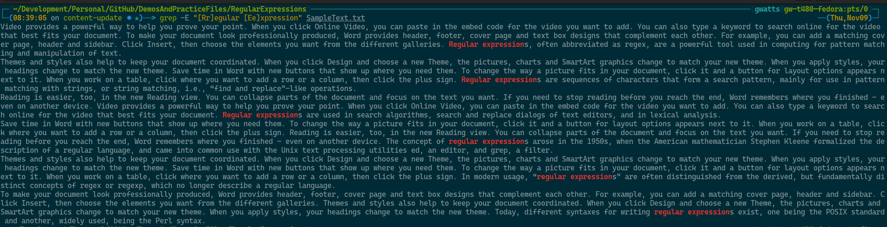

or this:

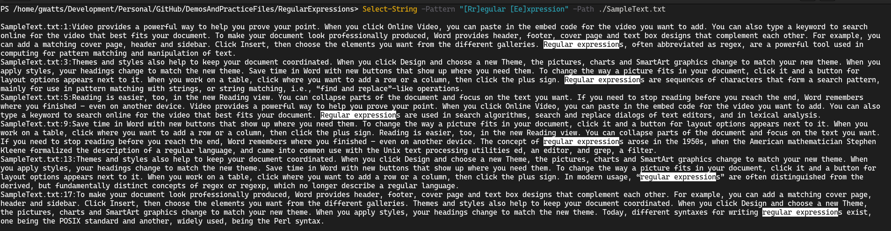

### Or Search Example

OK, so we have found all examples of the phrase "regular expression" in the file, regardless of capitalisation. But what if we wanted to find all instances of either "regular expression" or "regex"? Well, we can use the `|` character to indicate an "or" search. Let's try it:

```bash
grep -E '[Rr]egular [Ee]xpression|[Rr]egex' SampleText.txt
```

Or, in PowerShell:

```powershell
Select-String -Pattern '[Rr]egular [Ee]xpression|[Rr]egex' -Path SampleText.txt -AllMatches
```

**Note:** In PowerShell we need to use the `-AllMatches` parameter to get all the matches. Otherwise, only the first match on a given line will be indicated/returned.

Notice that we have added `|[Rr]egex` to the end of the search string. This will match either "regular expression" or "regex". The output should look like this:

The text output will be the same as for previous examples as in our sample text we only ever seen "regex" and "regular expressions" in the same lines. However, the highlighted output should look like this:

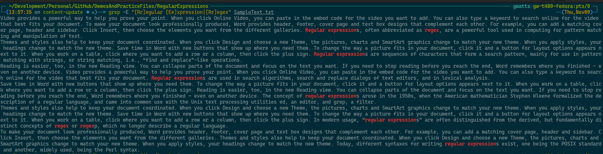

or this:

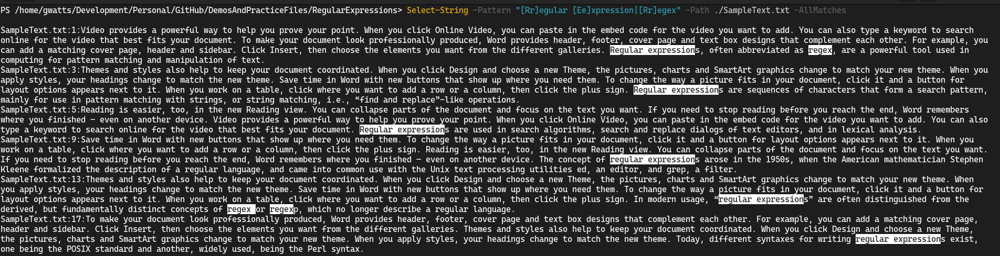

### Optional Characters Example

The eagle-eyed among you may have noticed that for some matches we're actually matching "regular expression" and for others we're matching "regular expressions", but we're not matching the "s" at the end of "expressions". Similarly we're not matching the "p" in "regexp". So, let's look at how we could match the whole word whether it's "expression" or "expressions", or "regex" or "regexp". We can do this using the `?` character to indicate that the previous character is optional. Let's try it:

```bash
grep -E '[Rr]egular [Ee]xpressions?|[Rr]egexp?' SampleText.txt
```

Or, in PowerShell:

```powershell
Select-String -Pattern '[Rr]egular [Ee]xpressions?|[Rr]egexp?' -Path SampleText.txt -AllMatches
```

Again, the text match will be the same as before, but the highlighted output should look like this:

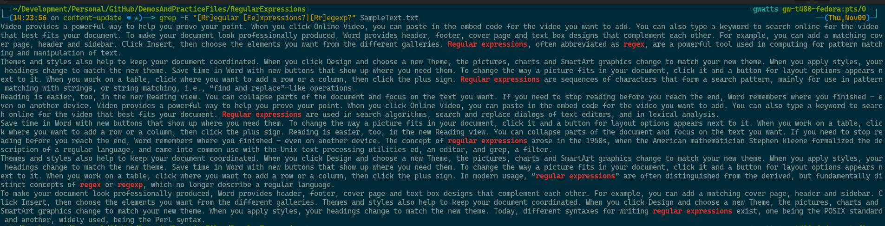

or this:

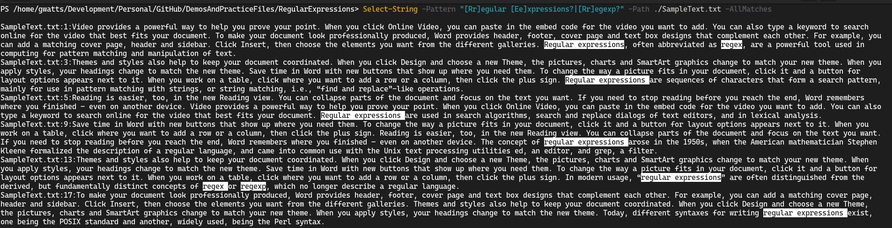

Notice now that the red text in grep, or the highlighted text in PowerShell, includes the "s" in "expressions" and the "p" in "regexp" whilst also matching the "regular expression" and "regex" phrases.

### Stretch Goals For Text File

1. Return only the matches for "regular expression(s)" or "regex(p)" (with or without the extra character) and not all of the text on the line. (Hint: this is a `grep` skill and not a regex skill.)
2. Extend the answer to (1) by now returning the line number of the match as well

[Back to the top](#top)

## Linux Log File: Linux_2k.log

In the `Linux_2k.log` we have entries from `/var/messages` on a Linux system. There have been a number of authentication failures for users trying to connect to SSH and we want to explore them using regular expressions. We'll look to try and find out which users have been trying to connect and from which IP addresses, and how often to see what information and patterns we can find.

To start with we know from reading the first part of the log that the log lines of interest are in this format:

```bash
Jun 21 08:56:36 combo sshd(pam_unix)[14281]: authentication failure; logname= uid=0 euid=0 tty=NODEVssh ruser= rhost=217.60.212.66  user=guest
```

Initially we're not interested in when the attempts happened or the service and process information, so we can ignore the first part of the line and focus on the following section:

```bash
authentication failure; logname= uid=0 euid=0 tty=NODEVssh ruser= rhost=217.60.212.66  user=guest
```

So maybe we can start with a simple search for the words "authentication failure" in the file:

```bash
grep -E 'authentication failure' Linux_2k.log
```

Or, in PowerShell:

```powershell
Select-String -Pattern 'authentication failure' -Path Linux_2k.log
```

The output should look like this:

```text
Jul 11 03:46:15 combo sshd(pam_unix)[31854]: authentication failure; logname= uid=0 euid=0 tty=NODEVssh ruser= rhost=82.77.200.128  user=root
Jul 11 03:46:15 combo sshd(pam_unix)[31853]: authentication failure; logname= uid=0 euid=0 tty=NODEVssh ruser= rhost=82.77.200.128  user=root
Jul 11 03:46:16 combo sshd(pam_unix)[31862]: authentication failure; logname= uid=0 euid=0 tty=NODEVssh ruser= rhost=82.77.200.128  user=root
Jul 11 03:46:17 combo sshd(pam_unix)[31855]: authentication failure; logname= uid=0 euid=0 tty=NODEVssh ruser= rhost=82.77.200.128  user=root
Jul 11 03:46:17 combo sshd(pam_unix)[31852]: authentication failure; logname= uid=0 euid=0 tty=NODEVssh ruser= rhost=82.77.200.128  user=root
Jul 11 03:46:19 combo sshd(pam_unix)[31860]: authentication failure; logname= uid=0 euid=0 tty=NODEVssh ruser= rhost=82.77.200.128  user=root
Jul 11 11:33:13 combo gdm(pam_unix)[2803]: authentication failure; logname= uid=0 euid=0 tty=:0 ruser= rhost= 
```

If we look closely though we can see that actually there are some entries here for services other than SSH, so we should adjust our search to be more specific. We can do this by adding the word "sshd" to our search string:

```bash
grep -E 'sshd.+?authentication failure' Linux_2k.log
```

Or, in PowerShell:

```powershell
Select-String -Pattern 'sshd.+?authentication failure' -Path Linux_2k.log
```

The output should look like this:

```text
Jul  1 10:56:43 combo sshd(pam_unix)[22268]: authentication failure; logname= uid=0 euid=0 tty=NODEVssh ruser= rhost=195.129.24.210  user=root
Jul  1 10:56:43 combo sshd(pam_unix)[22274]: authentication failure; logname= uid=0 euid=0 tty=NODEVssh ruser= rhost=195.129.24.210  user=root
Jul  1 10:56:44 combo sshd(pam_unix)[22276]: authentication failure; logname= uid=0 euid=0 tty=NODEVssh ruser= rhost=195.129.24.210  user=root
Jul  1 10:56:44 combo sshd(pam_unix)[22275]: authentication failure; logname= uid=0 euid=0 tty=NODEVssh ruser= rhost=195.129.24.210  user=root
Jul  2 04:15:33 combo sshd(pam_unix)[24588]: authentication failure; logname= uid=0 euid=0 tty=NODEVssh ruser= rhost=zummit.com 
Jul  2 04:15:33 combo sshd(pam_unix)[24587]: authentication failure; logname= uid=0 euid=0 tty=NODEVssh ruser= rhost=zummit.com 
Jul  2 04:15:33 combo sshd(pam_unix)[24590]: authentication failure; logname= uid=0 euid=0 tty=NODEVssh ruser= rhost=zummit.com 
```

We can now see that some attempts fail without even presenting a username, we're explicitly interested in those that do present a username, so let's add that to our search string:

```bash
grep -E 'sshd.+?authentication failure;.+?user=.+\b' Linux_2k.log
```

Or, in PowerShell:

```powershell
Select-String -Pattern 'sshd.+?authentication failure;.+?user=.+\b' -Path Linux_2k.log
```

The output should look like this:

```text
Jul 21 01:30:49 combo sshd(pam_unix)[3493]: authentication failure; logname= uid=0 euid=0 tty=NODEVssh ruser= rhost=210.76.59.29  user=root
Jul 21 01:30:50 combo sshd(pam_unix)[3488]: authentication failure; logname= uid=0 euid=0 tty=NODEVssh ruser= rhost=210.76.59.29  user=root
Jul 21 01:30:50 combo sshd(pam_unix)[3487]: authentication failure; logname= uid=0 euid=0 tty=NODEVssh ruser= rhost=210.76.59.29  user=root
Jul 21 15:18:30 combo sshd(pam_unix)[5587]: authentication failure; logname= uid=0 euid=0 tty=NODEVssh ruser= rhost=193.110.106.11  user=root
Jul 21 15:18:30 combo sshd(pam_unix)[5586]: authentication failure; logname= uid=0 euid=0 tty=NODEVssh ruser= rhost=193.110.106.11  user=root
Jul 23 11:46:41 combo sshd(pam_unix)[15385]: authentication failure; logname= uid=0 euid=0 tty=NODEVssh ruser= rhost=85.44.47.166  user=root
```

Now, let's look at how many times each user has been tried in these failed attempts. As we're focusing on `grep` there are some limitations on what we can do, other tools may be better, but let's stick with grep for now. With `grep` this will mean piping the output of one `grep` command into another `grep` command which we can use with the `-o` flag to only return the matched text to trim down to just the `user=<username>` portion of the line. We will then use some other bash tools such as `cut`, `sort` and `uniq` to count the number of times each user appears. Let's try it:

```bash
grep -E "sshd.+?authentication failure;.+?user=.+\b" Linux_2k.log | grep -oE "\buser=(.+?)\b" | cut -d "=" -f 2 | sort | uniq -c
```

Here we're taking the output from our first `grep` and we're piping it into a second `grep` which is adding the `-o` flag to only return the matched text. Here we're using `grep` to match the word "user" followed by an equals sign and then any number of characters until we hit a word boundary (`\b`). We're then piping that output into `cut` which is using the `-d` flag to specify the delimiter as the equals sign and the `-f` flag to specify that we want the second field. We're then piping that output into `sort` to sort the output and then piping that into `uniq` with the `-c` flag to count the number of times each line appears.

Which would give us the output:

```text
> grep -E "sshd.+?authentication failure;.+?user=.+\b" Linux_2k.log | grep -oE "\buser=(.+?)\b" | cut -d "=" -f 2 | sort | uniq -c

     17 guest
    351 root
      4 test
```

In PowerShell we can be a bit more direct thanks to the ability of PowerShell to quickly access capture groups. Let's try it:

```powershell
Select-String -Pattern 'sshd.+?authentication failure;.+?\buser=(.+)\b' -Path Linux_2k.log | ForEach-Object { $_.Matches.Groups[1].Value } | Group-Object | Sort-Object -Property Count -Descending | Format-Table -Property Count, Name
```

Which would gives us the output:

```text
> Select-String -Pattern 'sshd.+?authentication failure;.+?\buser=(.+)\b' -Path Linux_2k.log | ForEach-Object { $_.Matches.Groups[1].Value } | Group-Object | Sort-Object -Property Count -Descending | Format-Table -Property Count, Name                             

Count Name
----- ----
  351 root
   17 guest
    4 test
```

Here we have used the ForEach-Oject cmdlet to extract the capture group that we want, in this case `[1]` as `[0]` is always the full match. We then pipe that into the Group-Object cmdlet to group the results and then pipe that result into the Sort-Object cmdlet to sort the results by the Count property in descending order.

### Stretch Goals For Linux Log File

1. Capture the remote system (`rhost`) as well as the user and see how many times each remote host tried each user.

[Back to the top](#top)

## Web Server Log File: ApacheWeb.log

In the `ApacheWeb.log` we have some AI generated entries similar to those found in a `/var/log/apache2/access.log` on a Linux system. We want to explore the log file using regular expressions to see what information and patterns we can find.

### Finding Errors in Web Logs

In our ApacheWeb.log we have a number of web pages which have generated errors. It's our job to find the pages, and the errors that occurred.

Starting by inspecting our log we can see that we have logs in this format:

```text
192.168.1.2 - - [09/Nov/2023:13:43:48 +0000] "GET /products/product-11.html HTTP/1.1" 200 4578
```

It is possible to look up the full format of the log file and what each piece of data represents, however for speed we can quickly see that the pages are in the format of `/products/product-11.html` and that the HTTP return codes follow the protocol used (e.g. `HTTP/1.1`) in the format of 3 digits (e.g. `200`). So we know where to look. If you've ever done much on the web you'll be familiar with some common web error codes like `404` and you can quickly look up to see that error codes are in the `4xx` and `5xx` ranges.

While the example we've seen only has `/products/product-11.html` we should assume that it may not always be this way and that we might have `/dir1/dir2/dir3/page.extension`; by thinking this way we ensure that we don't miss pages that might be in a different format, or pages that might be in a different directory.

So, let's state our goals:

- To find any line which was a return code in the `4xx` or `5xx` range
- For those lines with a return code of `4xx` or `5xx` we want to capture the page that was requested in the format of one or more directories in the UNIX format of `/dir1/dir2/etc...` followed by a page name and extension (e.g. `page.html` or `page.php`)

Now that we know what we want let's have a look at our regex options.

We know that we want to match a return code in the `4xx` or `5xx` range, so we can start with something like this:

```bash
grep -E "[45][0-9][0-9]" ApacheWeb.log
```

Or, in PowerShell:

```powershell
Select-String -Pattern "[45][0-9][0-9]" -Path ApacheWeb.log
```

Remembering that `grep -E` doesn't support `\d` we can use `[0-9]` range statements instead. Alternatively we could use the `-P` flag to enable Perl regular expressions and use `\d` instead resulting in this:

```bash
grep -P "[45]\d\d" ApacheWeb.log
```

Or, in PowerShell:

```powershell
Select-String -Pattern "[45]\d\d" -Path ApacheWeb.log
```

We can simplify this further with the repetition operator `{}` to indicate that we want to match the previous character or character set a specific number of times. In this case we want to match `\d` twice as that will give us 4 or 5 followed by 2 additional digits. So we can use this:

```bash
grep -P "[45]\d{2}" ApacheWeb.log
```

Or, in PowerShell:

```powershell
Select-String -Pattern "[45]\d{2}" -Path ApacheWeb.log
```

The output of which would look like this:

```text
> grep -P "[45]\d{2}" ApacheWeb.log

192.168.1.2 - - [09/Nov/2023:13:43:27 +0000] "POST /form HTTP/1.1" 200 4638
192.168.1.3 - - [09/Nov/2023:13:43:28 +0000] "GET /images/logo.png HTTP/1.1" 200 15494
192.168.1.1 - - [09/Nov/2023:13:43:29 +0000] "GET /about.html HTTP/1.1" 200 3542
192.168.1.2 - - [09/Nov/2023:13:43:30 +0000] "GET /contact.html HTTP/1.1" 200 2548
192.168.1.3 - - [09/Nov/2023:13:43:31 +0000] "GET /products.html HTTP/1.1" 200 4578
192.168.1.2 - - [09/Nov/2023:13:43:36 +0000] "POST /form HTTP/1.1" 200 4638
192.168.1.1 - - [09/Nov/2023:13:43:38 +0000] "GET /products/product-1.html HTTP/1.1" 200 4578
192.168.1.2 - - [09/Nov/2023:13:43:39 +0000] "GET /products/product-2.html HTTP/1.1" 200 4578
192.168.1.3 - - [09/Nov/2023:13:43:40 +0000] "GET /products/product-3.html HTTP/1.1" 200 4578
192.168.1.1 - - [09/Nov/2023:13:43:41 +0000] "GET /products/product-4.html HTTP/1.1" 200 4578
192.168.1.2 - - [09/Nov/2023:13:43:42 +0000] "GET /products/product-5.html HTTP/1.1" 200 4578
192.168.1.3 - - [09/Nov/2023:13:43:43 +0000] "GET /products/product-6.html HTTP/1.1" 200 4578
192.168.1.1 - - [09/Nov/2023:13:43:44 +0000] "GET /products/product-7.html HTTP/1.1" 200 4578
192.168.1.2 - - [09/Nov/2023:13:43:45 +0000] "GET /products/product-8.html HTTP/1.1" 200 4578
192.168.1.3 - - [09/Nov/2023:13:43:46 +0000] "GET /products/product-9.html HTTP/1.1" 200 4578
192.168.1.1 - - [09/Nov/2023:13:43:47 +0000] "GET /products/product-10.html HTTP/1.1" 200 4578
192.168.1.2 - - [09/Nov/2023:13:43:48 +0000] "GET /products/product-11.html HTTP/1.1" 200 4578
192.168.1.1 - - [09/Nov/2023:13:43:49 +0000] "GET /products/product-12.html HTTP/1.1" 403 -
```

Now; this doesn't look right and if we look at the highlighting on the shell we can start to see why:

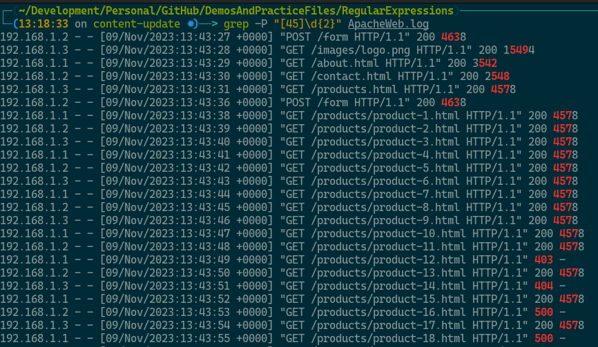

What we need to do is ensure that we account for the gap, space, or boundary between the return code and the rest of the line. We can do this by using the `\b` word boundary character. Let's try it:

```bash
grep -P "\b([45]\d{2})\b" ApacheWeb.log
```

Or, in PowerShell:

```powershell
Select-String -Pattern "\b([45]\d{2})\b" -Path ApacheWeb.log
```

We've added `\b` word boundaries to the start and end of the regex and we've also added `()` capture group so that can separate the return code from the rest of the line later on. The output should look like this:

```text
> grep -P "\b([45]\d{2})\b" ApacheWeb.log

192.168.1.1 - - [09/Nov/2023:13:43:49 +0000] "GET /products/product-12.html HTTP/1.1" 403 -
192.168.1.3 - - [09/Nov/2023:13:43:51 +0000] "GET /products/product-14.html HTTP/1.1" 404 -
192.168.1.2 - - [09/Nov/2023:13:43:53 +0000] "GET /products/product-16.html HTTP/1.1" 500 -
192.168.1.1 - - [09/Nov/2023:13:43:55 +0000] "GET /products/product-18.html HTTP/1.1" 500 -
192.168.1.3 - - [09/Nov/2023:13:43:57 +0000] "GET /products/product-20.html HTTP/1.1" 403 -
192.168.1.2 - - [09/Nov/2023:13:43:59 +0000] "GET /products/product-22.html HTTP/1.1" 404 -
192.168.1.1 - - [09/Nov/2023:13:44:01 +0000] "GET /products/product-24.html HTTP/1.1" 404 -
192.168.1.3 - - [09/Nov/2023:13:44:03 +0000] "GET /products/product-26.html HTTP/1.1" 500 -
```

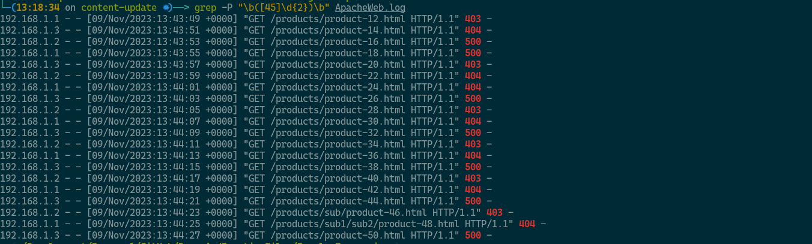

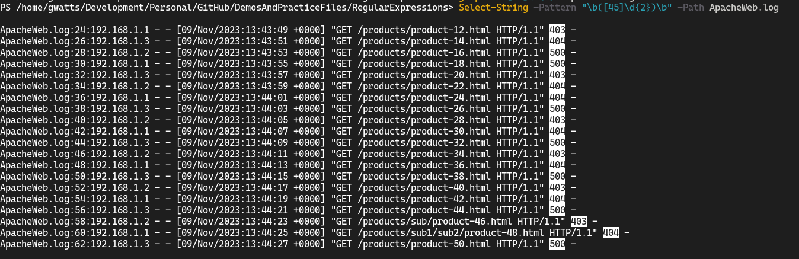

That looks better! Now we can see that we have a number of `403`, `404` and `500` errors.

Now, let's think about the directory paths and page files. We know that we want to capture the page file and we know that it will be in the format of `/dir1/dir2/dir3/page.extension` where `dir1`, `dir2` and `dir3` are optional and `page.extension` is mandatory. We also know that the page file will be preceded by a space and that it will be followed by a space. So, let's try this:

```bash
grep -P "\s((\/.+?\/){1,}.+?\..+?)\s" ApacheWeb.log
```

Or, in PowerShell:

```powershell
Select-String -Pattern "\s((\/.+?\/){1,}.+?\..+?)\s" -Path ApacheWeb.log
```

There's a big leap here so let's break this down, also see my [blog post](https://www.grahamwatts.co.uk/regex/#the-regular-expression-character-set) on regular expressions for more help and guidance with these special characters.

- `\s` - match a space character
  - We're using this to match the space before and after the page file
  - We're using this because the date and time are also in a format using `/` and may unintentionally match
- `\/` - match a forward slash character `/`
  - We're using this to match the forward slashes in the directory paths
  - We're escaping the forward slash with a backslash because forward slashes are special characters in regular expressions and we want to match the literal `/`
- `.+?` - match any character one or more times, but as few times as possible
  - By using this between `\/` and `\/` we're matching any text in the directory path, not just `products` which the log has a lot or but it's not the only path
- `{1,}` - match the previous character or character set one or more times
  - We're using this to ensure that we match at least one directory path
  - We're using this because we are making the assumption that the page file is always preceded by at least one directory path. In our case this is true, but it may not always be true.
- `\.` - match a literal full stop character `.`
  - We're using this to match the full stop in the file extension
  - We're escaping the full stop with a backslash because full stops are special characters in regular expressions and we want to match the literal `.`
  
We've also used 2 capture groups:

- `((\/.+?\/){1,}.+?\..+?)`
  - This is the first capture group and it's capturing the whole page file
  - We're using this so that we can extract the page file later on
- `((\/.+?\/)`
  - This is the second capture group and it's capturing the directory path
  - We're using this so that we can apply the `{1,}` repetition operator to the directory path capturing any number of `/dirX/` values in the path

The returned output should look like this:

```text
> grep -P "\s((\/.+?\/){1,}.+?\..+?)\s" ApacheWeb.log

192.168.1.1 - - [09/Nov/2023:13:43:26 +0000] "GET / HTTP/1.1" 200 2326
192.168.1.2 - - [09/Nov/2023:13:43:27 +0000] "POST /form HTTP/1.1" 200 4638
192.168.1.3 - - [09/Nov/2023:13:43:28 +0000] "GET /images/logo.png HTTP/1.1" 200 15494
192.168.1.1 - - [09/Nov/2023:13:43:29 +0000] "GET /about.html HTTP/1.1" 200 3542
192.168.1.2 - - [09/Nov/2023:13:43:30 +0000] "GET /contact.html HTTP/1.1" 200 2548
192.168.1.3 - - [09/Nov/2023:13:43:31 +0000] "GET /products.html HTTP/1.1" 200 4578
192.168.1.1 - - [09/Nov/2023:13:43:32 +0000] "GET /services.html HTTP/1.1" 200 3654
192.168.1.2 - - [09/Nov/2023:13:43:33 +0000] "GET /images/banner.jpg HTTP/1.1" 200 7896
192.168.1.3 - - [09/Nov/2023:13:43:34 +0000] "GET /css/styles.css HTTP/1.1" 200 1024
192.168.1.1 - - [09/Nov/2023:13:43:35 +0000] "GET /js/scripts.js HTTP/1.1" 200 2048
192.168.1.2 - - [09/Nov/2023:13:43:36 +0000] "POST /form HTTP/1.1" 200 4638
192.168.1.3 - - [09/Nov/2023:13:43:37 +0000] "GET /favicon.ico HTTP/1.1" 200 1150
192.168.1.1 - - [09/Nov/2023:13:43:38 +0000] "GET /products/product-1.html HTTP/1.1" 200 4578
192.168.1.2 - - [09/Nov/2023:13:43:39 +0000] "GET /products/product-2.html HTTP/1.1" 200 4578
```

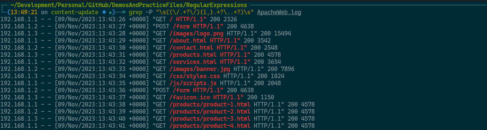

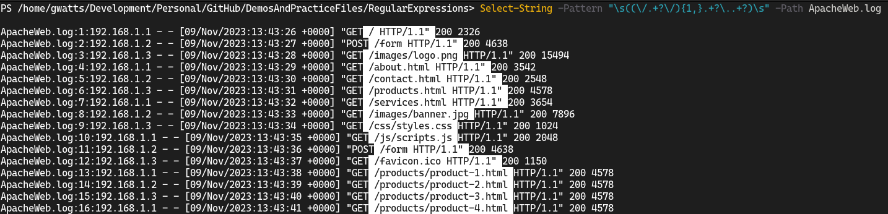

We now have 2 functioning regular expressions that we can combine together to start finding what we want.  We do, however, need to consider that there is some text between the sections that we really care about that we should account for too in our regex, but a simple `.+?` should take care of that. Let's try it:

```bash
grep -P "\s((\/.+?\/){1,}.+?\..+?)\s.+?\b([4-5]\d{2})\b" ApacheWeb.log
```

Or, in PowerShell:

```powershell
Select-String -Pattern "\s((\/.+?\/){1,}.+?\..+?)\s.+?\b([4-5]\d{2})\b" -Path ApacheWeb.log
```

The output should look like this:

```text
> grep -P "\s((\/.+?\/){1,}.+?\..+?)\s.+?\b([4-5]\d{2})\b" ApacheWeb.log

192.168.1.1 - - [09/Nov/2023:13:43:49 +0000] "GET /products/product-12.html HTTP/1.1" 403 -
192.168.1.3 - - [09/Nov/2023:13:43:51 +0000] "GET /products/product-14.html HTTP/1.1" 404 -
192.168.1.2 - - [09/Nov/2023:13:43:53 +0000] "GET /products/product-16.html HTTP/1.1" 500 -
192.168.1.1 - - [09/Nov/2023:13:43:55 +0000] "GET /products/product-18.html HTTP/1.1" 500 -
192.168.1.3 - - [09/Nov/2023:13:43:57 +0000] "GET /products/product-20.html HTTP/1.1" 403 -
192.168.1.2 - - [09/Nov/2023:13:43:59 +0000] "GET /products/product-22.html HTTP/1.1" 404 -
```

Which looks about right!

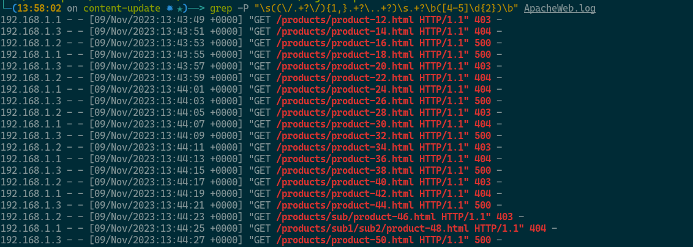

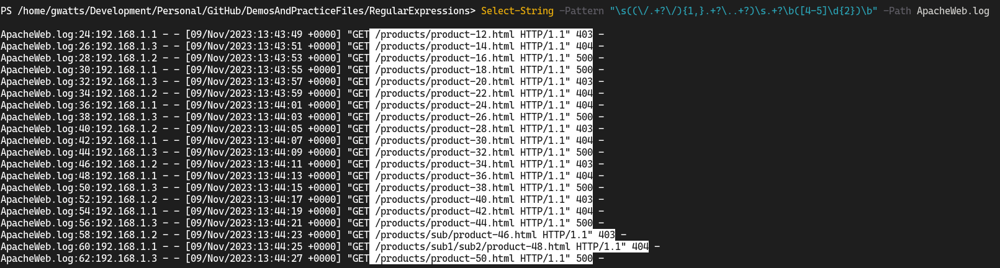

### Match Groups

Let's continue the above example on a bit further and make use of those capture groups.

We'll work with PowerShell for this example as it gives easier access to the capture group values. If you're working with Linux tools like `sed` or `awk` as opposed to `grep` then you'll have access to the capture groups to work in a similar way.

To restate where we got to in the previous example, we have a regular expression that looks like this:

```powershell
Select-String -Pattern "\s((\/.+?\/){1,}.+?\..+?)\s.+?\b([4-5]\d{2})\b" -Path ApacheWeb.log
```

Which returned output that looked like this:

```text
> Select-String -Pattern "\s((\/.+?\/){1,}.+?\..+?)\s.+?\b([4-5]\d{2})\b" -Path ApacheWeb.log

ApacheWeb.log:24:192.168.1.1 - - [09/Nov/2023:13:43:49 +0000] "GET /products/product-12.html HTTP/1.1" 403 -
ApacheWeb.log:26:192.168.1.3 - - [09/Nov/2023:13:43:51 +0000] "GET /products/product-14.html HTTP/1.1" 404 -
ApacheWeb.log:28:192.168.1.2 - - [09/Nov/2023:13:43:53 +0000] "GET /products/product-16.html HTTP/1.1" 500 -
ApacheWeb.log:30:192.168.1.1 - - [09/Nov/2023:13:43:55 +0000] "GET /products/product-18.html HTTP/1.1" 500 -
ApacheWeb.log:32:192.168.1.3 - - [09/Nov/2023:13:43:57 +0000] "GET /products/product-20.html HTTP/1.1" 403 -
ApacheWeb.log:34:192.168.1.2 - - [09/Nov/2023:13:43:59 +0000] "GET /products/product-22.html HTTP/1.1" 404 -
ApacheWeb.log:36:192.168.1.1 - - [09/Nov/2023:13:44:01 +0000] "GET /products/product-24.html HTTP/1.1" 404 -
ApacheWeb.log:38:192.168.1.3 - - [09/Nov/2023:13:44:03 +0000] "GET /products/product-26.html HTTP/1.1" 500 -
ApacheWeb.log:40:192.168.1.2 - - [09/Nov/2023:13:44:05 +0000] "GET /products/product-28.html HTTP/1.1" 403 -
ApacheWeb.log:42:192.168.1.1 - - [09/Nov/2023:13:44:07 +0000] "GET /products/product-30.html HTTP/1.1" 404 -
ApacheWeb.log:44:192.168.1.3 - - [09/Nov/2023:13:44:09 +0000] "GET /products/product-32.html HTTP/1.1" 500 -
ApacheWeb.log:46:192.168.1.2 - - [09/Nov/2023:13:44:11 +0000] "GET /products/product-34.html HTTP/1.1" 403 -
ApacheWeb.log:48:192.168.1.1 - - [09/Nov/2023:13:44:13 +0000] "GET /products/product-36.html HTTP/1.1" 404 -
ApacheWeb.log:50:192.168.1.3 - - [09/Nov/2023:13:44:15 +0000] "GET /products/product-38.html HTTP/1.1" 500 -
ApacheWeb.log:52:192.168.1.2 - - [09/Nov/2023:13:44:17 +0000] "GET /products/product-40.html HTTP/1.1" 403 -
ApacheWeb.log:54:192.168.1.1 - - [09/Nov/2023:13:44:19 +0000] "GET /products/product-42.html HTTP/1.1" 404 -
ApacheWeb.log:56:192.168.1.3 - - [09/Nov/2023:13:44:21 +0000] "GET /products/product-44.html HTTP/1.1" 500 -
ApacheWeb.log:58:192.168.1.2 - - [09/Nov/2023:13:44:23 +0000] "GET /products/sub/product-46.html HTTP/1.1" 403 -
ApacheWeb.log:60:192.168.1.1 - - [09/Nov/2023:13:44:25 +0000] "GET /products/sub1/sub2/product-48.html HTTP/1.1" 404 -
ApacheWeb.log:62:192.168.1.3 - - [09/Nov/2023:13:44:27 +0000] "GET /products/product-50.html HTTP/1.1" 500 -
```

Now we want to just return the bits of information that we were originally interested in, the error code and the page that generated the error.

We can do this by using the `-AllMatches` flag to return all of the matches for each line and then using the `-ExpandProperty` flag to expand the Matches property of each line. We can then use the `-Property` flag to select the properties that we want to return. Let's try it:

```powershell
Select-String -Pattern "\s((\/.+?\/){1,}.+?\..+?)\s.+?\b([4-5]\d{2})\b" -Path ApacheWeb.log -AllMatches | Select-Object -ExpandProperty Matches | Select-Object -Property Value
```

This, however, prints the whole matched snippet, not just the capture groups that we really care about, page file and error code. We can fix this by using the `ForEach-Object` cmdlet and its `Join` method to join the capture groups together with a space. Let's try it:

```powershell
Select-String -Pattern "\s((\/.+?\/){1,}.+?\..+?)\s.+?\b([4-5]\d{2})\b" -Path ApacheWeb.log -AllMatches | ForEach-Object { [string]::Join(" ",($_.Matches.Groups[1,3].Value)) }
```

This then gives us this:

```text
> Select-String -Pattern "\s((\/.+?\/){1,}.+?\..+?)\s.+?\b([4-5]\d{2})\b" -Path ApacheWeb.log -AllMatches | ForEach-Object { [string]::Join(" ",($_.Matches.Groups[1,3].Value)) }

/products/product-12.html 403
/products/product-14.html 404
/products/product-16.html 500
/products/product-18.html 500
/products/product-20.html 403
/products/product-22.html 404
```

Which looks about right for what we needed right now.  We could do a lot more with PowerShell to manipulate this as a table, collate the results, etc. but that's beyond the scope of this example.

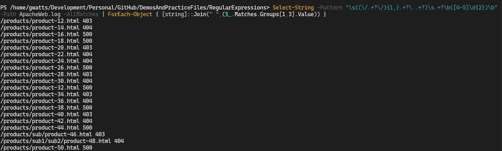

### Stretch Goals For Web Server Log File

1. Find all of the IP addresses that have generated errors
2. Combined the search from the pages as shown above with your search from (1) to find all of the pages that have generated errors and the IP addresses that generated them

[Back to the top](#top)

## Stretch Goal Answers

The answers supplied here are one way of achieving the result, you may find other ways of achieving the same result.

While PowerShell is very powerful, it can be tricky for a new learner to get to grips with manipulating the objects returned from each cmdlet. You'll notice that the PowerShell examples may look more complicated. Once you're familiar with PowerShell you'll find that it's often easier to achieve the same result in PowerShell than it is in bash, but the learning curve is steeper to get there.

### Text File

1. Return only the matches for "regular expression(s)" or "regex(p)" (with or without the extra character) and not all of the text on the line. (Hint: this is a `grep` skill and not a regex skill.)
   - Linux: `grep -oE "[Rr]egular [Ee]xpressions?|[Rr]egexp?" SampleText.txt`
   - PowerShell: `Select-String -Pattern "[Rr]egular [Ee]xpressions?|[Rr]egexp?" -Path SampleText.txt -AllMatches | Select-Object -ExpandProperty Matches | Select-Object Value`
2. Extend the answer to (1) by now returning the line number of the match as well
   - Linux: `grep -noE "[Rr]egular [Ee]xpressions?|[Rr]egexp?" SampleText.txt`
   - PowerShell: `Select-String -Pattern "[Rr]egular [Ee]xpressions?|[Rr]egexp?" -Path SampleText.txt -AllMatches | ForEach-Object { $lineNumber = $_.LineNumber; $_.Matches | ForEach-Object { [PSCustomObject]@{ LineNumber = $lineNumber; Value = $_.Value } } }`

### Linux Log File

1. Capture the remote system (`rhost`) as well as the user and see how many times each remote host tried each user.
   - Linux: `grep -E "sshd.+?authentication failure;.+?user=.+\b" Linux_2k.log | grep -oE "\brhost=(.+?)\s\buser=(.+?)\b" | sort | uniq -c | sort `
   - PowerShell: `Select-String -Pattern 'sshd.+?authentication failure;.+?\brhost=(.+?)\s+?\buser=(.+)\b' -Path Linux_2k.log | ForEach-Object {[string]::Join(" ",($_.Matches.Groups[1,2].Value)) } | Group-Object | Sort-Object -Property Name -Descending | Format-Table -Property Count,Name`

### Web Server Log File

1. Find all of the IP addresses that have generated errors
   - Linux: `grep -P "\s((\/.+?\/){1,}.+?\..+?)\s.+?\b([4-5]\d{2})\b" ApacheWeb.log | grep -oE "^[0-9.]+?" | sort | uniq`
   - PowerShell: `Select-String -Pattern "^((\d{1,3}\.){3}\d{1,3}).+?\s([45]\d{2})\s" -Path ./ApacheWeb.log -AllMatches | ForEach-Object { [string]::Join(" ", ($_.Matches.Groups[1,3].Value)) } | Sort-Object | Get-Unique`
2. Combined the search from the pages as shown above with your search from (1) to find all of the pages that have generated errors and the IP addresses that generated them
   - Linux: `grep -P "^\s*([0-9.]+)\s+-\s+-\s+\[.+\]\s+\"\w+\s+((\/.+?\/){1,}.+?\..+?)\s+HTTP\/\d\.\d\"\s+([4-5]\d{2})\s" ApacheWeb.log | awk '{print $1, $7, $9}'`
     - As we saw in the tutorial, `grep` isn't the best tool to return only selected matches to I'm sneaking in some `awk` to return only the IP address, page file and error code.
   - PowerShell: `Select-String -Pattern "^((\d{1,3}\.){3}\d{1,3}).+?\s((\/.+?\/){1,}.+?\..+?)\s.+?\b([4-5]\d{2})\b" -Path ApacheWeb.log -AllMatches | ForEach-Object { [string]::Join(" ",($_.Matches.Groups[1,3,5].Value)) } | Sort-Object | Get-Unique`


[Back to the top](#top)
